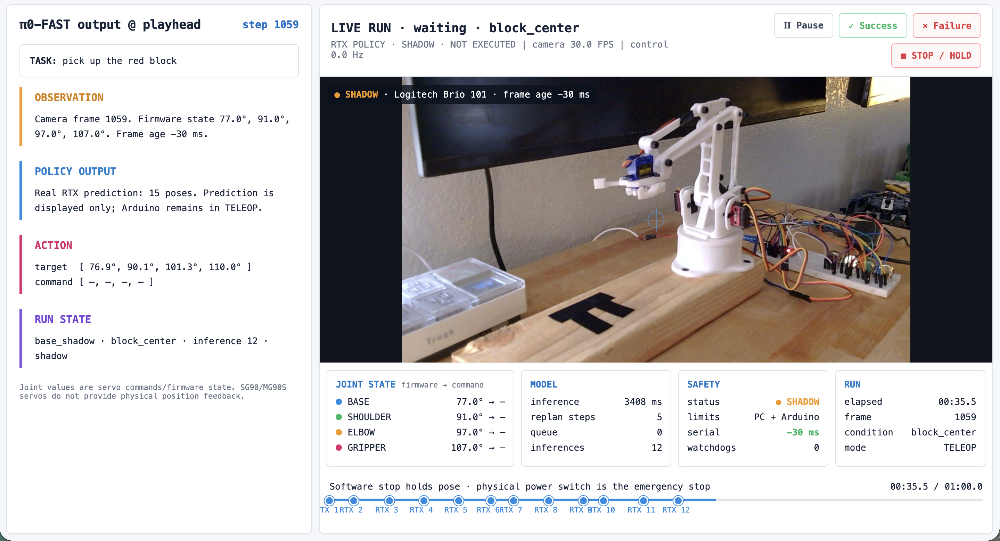

# pi0-on-a-budget

Fine-tuning Physical Intelligence's [π0-FAST](https://github.com/Physical-Intelligence/openpi)
with LoRA on a consumer RTX 4070 (12 GB), using demonstrations from
[gello-lite](https://github.com/imjbassi/gello-lite) — a 4-DOF hobby-servo,
potentiometer-leader teleoperation arm — then evaluating open-loop vs closed-loop.

Negative results are documented as results. Measured numbers live in [RESULTS.md](RESULTS.md).

## Status

| Phase | State |
|---|---|
| 0. Recorder: joints + camera | Built. Arduino telemetry and the live camera/dashboard path have run on hardware. Current deployment camera is a Logitech Brio 101 at 1280×720/30 fps; formal Brio timing validation is still pending. The previous ZV-1F measurement remains in `RESULTS.md` as historical data. |
| 1. Recorder → LeRobot converter | Built. Verified on synthetic episodes through openpi's own data loader (chunks match exactly). |
| 1b. WSL2 + openpi + GPU | Done. openpi `215abfb`, JAX sees the RTX 4070. |
| 2a. 12 GB memory test | **No valid training measurement yet.** Loading from `/mnt/d` failed with host `ENOMEM`; the shadow helper now copies params to WSL ext4 and the documented WSL profile provides 24 GB RAM + 16 GB swap. See [RESULTS.md](RESULTS.md). |
| 2b. Fine-tuning on real episodes | Waiting on data collection: arm rebuilt and calibrated, 0 real episodes recorded. |
| 3. Open-loop eval, closed-loop controller, analysis | Built; tested with fakes (dry-run controller, hold-policy). Not run on real data. |
| Arduino `policy_follower.ino` | Running on the Nano for dashboard telemetry/shadow mode. Limits match `config/robot.json`; closed-loop policy execution remains unvalidated. |

### Known risks, stated up front
- **Memory.** openpi documents LoRA fine-tuning as needing **> 22.5 GB**. Its stock
  π0-FAST LoRA config freezes only the language model; the ~400M-param image encoder
  still trains in float32 with AdamW state. This project also freezes the image
  encoder — a departure from openpi's recipe. The base checkpoint is 10.85 GB;
  WSL's former 15 GB default caused host-side restore failures, so inference now
  uses the documented 24 GB WSL profile and an ext4-local parameter copy.
- **Embodiment.** π0's pretraining normalization stats cover ALOHA, Franka, UR5e, ARX
  arms (6–7 DOF, industrial actuators). Nothing resembles a 4-DOF hobby-servo arm, so
  fresh norm stats are used and transfer may be weak.
- **No measured state.** The SG90/MG90S servos have no position feedback. "State" is the commanded
  angle, not the arm's actual position — in training and on the real arm alike.
- **Hold baseline.** At 30 fps consecutive commands are nearly identical, so "don't
  move" already scores a low open-loop error. Every open-loop number is reported next
  to that baseline.

## Layout

```
recorder/            Windows: record episodes (serial + camera), timing report
gello_pi0/           shared conventions + everything that runs in openpi (WSL)
  conventions.py       degrees <-> model units, image preprocessing (one definition, both sides)
  episodes.py          load + resample episodes to a uniform 30 fps timeline, held-out split
  convert_to_lerobot.py
  openpi_configs.py    policy transforms + training configs (registered into openpi)
  run.py               runs openpi's train / compute_norm_stats / serve_policy with those configs
  loadback_check.py    verifies the dataset through openpi's own loader
  memory_probe.py      measures peak GPU memory for a few real training steps
  eval_open_loop.py    policy vs recorded actions on held-out episodes
  policy_client.py     Windows client for openpi's policy server
  analyze.py           open-loop vs closed-loop, overall and per condition
closedloop/          Windows: drive the real arm with the policy, score trials
arduino/             policy_follower.ino (teleop mode + serial command mode)
config/robot.json    confirmed gripper direction + measured hardware limits
tools/               synthetic episode generator
wsl/                 openpi setup + environment wrapper
```

Large datasets and training checkpoints go to `D:\pi0-on-a-budget-runs`. The
inference helper makes one deliberate exception: it copies the 10.85 GB base
parameters to `~/pi0-cache` inside WSL because TensorStore reads from `/mnt/d`
failed with `OS error 12: ENOMEM` on this machine.

## Workflow

### 1. Record (Windows)
```
pip install -r recorder/requirements.txt
python recorder/record_episode.py --list-cameras
python recorder/record_episode.py --port COM3 --camera 0 --camera-label "Logitech Brio 101" --width 1280 --height 720 --fps 30 --task "pick up the red block" --condition block_left --outdir D:/pi0-on-a-budget-runs/episodes
python recorder/sync_report.py D:/pi0-on-a-budget-runs/episodes
```
`--condition` labels the scene setup (e.g. block position). It stratifies the held-out
split and is how open-loop and closed-loop results get compared per condition.

### 2. Convert + check (WSL)
```
bash wsl/setup_openpi.sh                  # once
bash wsl/run.sh python -m gello_pi0.convert_to_lerobot --episodes /mnt/d/pi0-on-a-budget-runs/episodes --robot-config config/robot.json --name gello
bash wsl/run.sh python -m gello_pi0.run norm-stats --config-name gello_lora
bash wsl/run.sh python -m gello_pi0.loadback_check --config gello_lora
```
The converter refuses real data until `config/robot.json` has gripper angles and
`confirmed_on_hardware: true`, and refuses to mix synthetic and real episodes.

### 3. Train (WSL)
```
bash wsl/run.sh python -m gello_pi0.memory_probe --config gello_lora --batch-sizes 1 2 4
bash wsl/run.sh python -m gello_pi0.run train gello_lora --exp-name run1 --batch-size <largest that fit>
```

### 4. Evaluate
Open-loop (WSL), once per checkpoint:
```
bash wsl/run.sh python -m gello_pi0.eval_open_loop --config gello_lora --checkpoint /mnt/d/pi0-on-a-budget-runs/checkpoints/gello_lora/run1/2999 --conversion-report /mnt/d/pi0-on-a-budget-runs/lerobot/local/gello_conversion.json
```
Closed-loop: flash `arduino/policy_follower`, start the server in WSL, run trials on Windows:
```
bash wsl/run.sh python -m gello_pi0.run serve policy:checkpoint --policy.config gello_lora --policy.dir /mnt/d/pi0-on-a-budget-runs/checkpoints/gello_lora/run1/2999
python closedloop/closed_loop.py --dashboard --port COM3 --camera 0 --camera-label "Logitech Brio 101" --robot-config config/robot.json --task "pick up the red block" --condition block_left --checkpoint-label run1_2999 --trials 10 --outdir D:/pi0-on-a-budget-runs/closed_loop
```
Try it with no hardware first: `python closedloop/closed_loop.py --dry-run --robot-config config/robot_fake.json --task t --condition c --checkpoint-label dry --trials 1`.

### Live dashboard

Add `--dashboard` to a closed-loop run. It opens `http://127.0.0.1:8765/` and
shows the live camera, policy action chunk, commanded joint values, inference
latency, frame/serial age, watchdog count, trial state, and timeline. Pause holds
the current command; Success and Failure score the trial on macOS or Windows;
STOP / HOLD aborts the trial and holds the pose. This is a
software stop, not an emergency stop: the physical power switch remains the
emergency control. Use
`--no-dashboard-browser` to serve it without opening a browser automatically.



*Real Mac-to-RTX shadow run with the Logitech Brio 101 and EEZYbotARM. The
policy predictions are displayed but deliberately not executed.*

The dashboard deliberately labels the joint display **firmware → command**.
The SG90/MG90S servos have no encoder feedback, so neither value is a measured physical
joint angle. No visual joint tracking is required. It also does not invent a
natural-language chain of thought: π0-FAST returns an action chunk, and that real
chunk is what the policy panel reports.

To inspect a real camera and Arduino on macOS without loading a policy or
sending motion commands, use monitor-only mode (servo power may remain
disconnected):
```
python closedloop/closed_loop.py --dashboard --monitor-only --backend any \
  --port /dev/cu.usbserial-110 --camera 0 --camera-label "Logitech Brio 101" \
  --robot-config config/robot.json \
  --task monitor --condition bench --checkpoint-label monitor
```
The Arduino must be running `policy_follower.ino`. Monitor-only mode permits an
unconfirmed robot config because it only reads telemetry. The dashboard's
STOP / HOLD button is the sole exception: pressing it sends the firmware's hold
command and exits the monitor.

### RTX policy shadow mode

Shadow mode sends the real camera image and Arduino state to a real policy
server, displays its latency and predicted action chunks, and never forwards
those actions to the Arduino. The arm remains in TELEOP and may be moved with
the leader while recording the dashboard.

### RTX PC preparation

The policy server needs more host memory while Orbax restores the model. On
this 32 GB PC, copy `wsl/wslconfig.example` to
`C:\Users\<you>\.wslconfig`, or create the equivalent file:

```ini
[wsl2]
memory=24GB
swap=16GB
```

Apply it from PowerShell only when no WSL training job is active:

```powershell
wsl --shutdown
```

Prepare the shadow checkpoint. The first run copies about 10.85 GB from D: to
WSL's Linux filesystem; later runs synchronize only changes:

```
wsl bash wsl/prepare_shadow_checkpoint.sh
```

From **PowerShell**, change directory with `Set-Location` (`cd /d` is Command
Prompt syntax), then start the RTX server:

```powershell
Set-Location "C:\Users\jaive.DESKTOP-3TNM9JL\Desktop\pi0-on-a-budget"
wsl bash wsl/run.sh python -m gello_pi0.run serve --port 8000 policy:checkpoint --policy.config gello_fake_base --policy.dir /mnt/d/pi0-on-a-budget-runs/shadow/pi0_fast_gello_fake
```

Do not add backslashes before underscores. ROCm and TPU initialization warnings
are expected on the NVIDIA PC. The server is ready only after it reports that
it is serving/listening on port 8000; a traceback followed by the PowerShell
prompt means it stopped. Initial loading can take several minutes.

`gello_fake_base` is intentional here: the shadow directory points to the
unmodified π0-FAST base checkpoint, which has no LoRA adapter tensors. Using
`gello_fake_lora` with those params fails with a PyTree `lora_a`/`lora_b`
structure mismatch. Use `gello_lora` only with a real trained LoRA checkpoint.

### Mac dashboard + Logitech Brio 101

Connect the Brio 101 and Arduino to the Mac. Find the camera index and serial
port each session:

```bash
python recorder/record_episode.py --list-cameras --backend any
ls /dev/cu.*
nc -vz WINDOWS_PC_IP 8000
```

Then run, replacing `WINDOWS_PC_IP` and the camera index if necessary:

```
python closedloop/closed_loop.py --dashboard --shadow-policy --backend any \
  --port /dev/cu.usbserial-110 --camera 0 --camera-label "Logitech Brio 101" \
  --camera-width 1280 --camera-height 720 --camera-fps 30 \
  --server ws://WINDOWS_PC_IP:8000 --robot-config config/robot.json \
  --task "pick up the red block" --condition block_center \
  --checkpoint-label base_shadow --trials 1 --max-trial-s 60
```

The base model and synthetic normalization statistics are not a trained
real-arm policy. The UI labels this mode `RTX POLICY · SHADOW · NOT EXECUTED`.

Analysis:
```
python -m gello_pi0.analyze --open-loop run1_2999=<.../2999/open_loop/summary.json> --open-loop run1_1000=<...> --closed-loop D:/pi0-on-a-budget-runs/closed_loop
```

### Tests
`python -m pytest tests` (Windows, no hardware). `loadback_check` is the WSL-side test.

## Logitech Brio 101 camera

The current camera target is 1280×720 at 30 fps. OpenCV indices can change when
virtual cameras or other USB cameras are added, so run `--list-cameras` each
session. OpenCV does not reliably expose device names; `--camera-label` records
the intended device in episode metadata and displays it in the UI, but the
numeric `--camera` index still selects the hardware.

- Close Zoom, FaceTime, OBS, browser camera tabs, and Logitech utilities before
  starting; another application may hold the camera.
- Mount the Brio rigidly with the complete arm and task workspace in frame.
- Keep resolution, position, field of view, exposure, white balance, and room
  lighting fixed between demonstrations and policy runs.
- The model input is letterboxed to 224×224, so 720p is sufficient and reduces
  USB/decode load. Verify delivered resolution and measured fps in the recorder
  metadata instead of assuming the driver honored the request.

## Frame/joint timing
Frames are paired with joint commands by **arrival time** on the PC. The camera's
own delay is not subtracted — deliberately: `closed_loop.py` pairs the newest frame
with the current command the same way, so training matches deployment.
